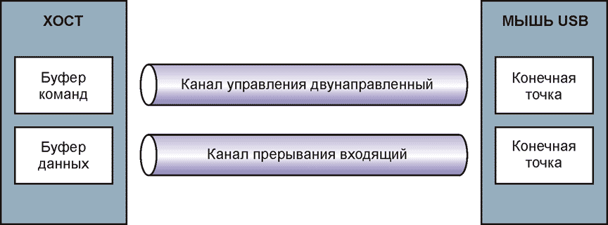
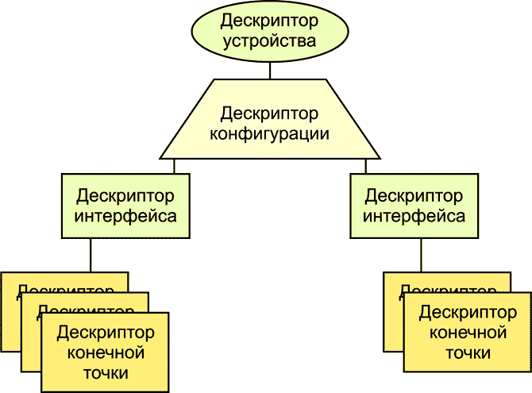
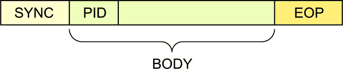
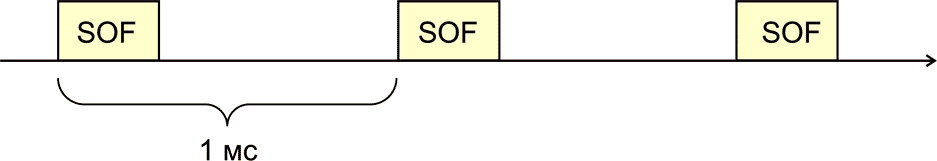
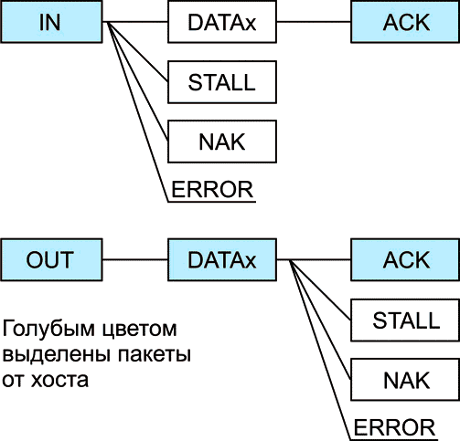

# Популярно о USB.

Немоляев А. В, г. Екатеринбург 12 августа 2014 г.

## Введение

У меня возникла необходимость разобраться с USB и, к своему удивлению, я обнаружил, что материалов по USB на русском языке не так уж много. Решил обобщить свой опыт изучения USB и передать всем желающим с ним познакомиться.

Публикация адресована начинающим разработчикам, тем, кто не знаком с USB, но хотел бы узнать больше. Статья носит учебный характер, и не является исчерпывающим справочным пособием. Для более простого вхождения в тему примеры основаны на стандарте USB 1.1. Если не сказано отдельно, то подразумевается режим FS (Full speed). В статье нет широко освещенных в других источниках сведений об общей топологии USB, о кабелях, хабах и разъемах. Здесь больше информации о том, что нужно знать разработчику устройств с микроконтроллерами о протоколе USB для своих разработок. Для устройств USB подключаемых к PC, таких, как мышь, клавиатура, микроконтроллер с поддержкой шины USB, использую термин USB-устройство. Персональный компьютер, к которому подключается USB-устройство, называю хостом. Доступное изложение теории, будет сопровождаться примерами программ на языке С для микроконтроллера AT90USB162 из популярной линейки megaAVR фирмы Atmel. В качестве источника справочной информации по USB рекомендую книгу Гук М. Ю. «Шины PCI, USB и FireWire. Энциклопедия», издательство «Питер».

## Обзор темы

Программное обеспечение хоста делится на два отдельных типа: программное обеспечение инициализации канала связи и программное обеспечение поддержки рабочего режима обмена данными. Программное обеспечение инициализации начинает работать при подключении к хосту нового USB-устройства. Происходит обмен служебной информацией между хостом и USB-устройством. В результате обменов служебной информацией, хост определяет: тип устройства, его требования к энергопотреблению, возможность поддержки «спящего режима», тип драйверов для правильной работы USB-устройства, и, даже, возможна ли загрузка необходимых прикладных программ для работы с USB-устройством. Это новые веяния в духе спецификации PNP (plug and play). Устройства могут подключаться и отключаться в горячем режиме. При подключении и отключении происходит автоматическое переконфигурирование программного обеспечения хоста. Процесс настройки хоста на обмен данными, напоминает процесс раскрутки. Первоначально обмениваются простейшими сигналами по шине, затем процесс усложняется и, наконец, выход на рабочий режим.

Программное обеспечение рабочего режима поддерживает обмен данными, когда хост соответственно сконфигурирован, и USB-устройство вышло на рабочий режим обмена. В спецификации USB этот начальный процесс называется энумерацией.

В последнее время имеется тенденция к унификации не только протоколов обмена, но и устройств, взаимодействующих с персональным компьютером. Точнее, унификация требований к каналу связи. Идея такая. Придумывается универсальная шина для всего, что только можно подключить. Конечно, эта шина устроена сложно, она многоуровневая, гибкая и адаптируемая для разных конфигураций устройств. Унифицируются и драйверы операционной системы персонального компьютера, который взаимодействует с подключаемым устройством. Преимущество – отпадает необходимость в написании драйвера для ОС разработчиками USB-устройства. Это должно повышать надежность ОС, так как созданием драйверов могут заняться разработчики ОС, а не разработчики устройств. В общем, все плюсы унификации и стандартизации. Но есть и минусы. Очевидная сложность и связанная с ней избыточность, громоздкость технических решений. Тот же подход, что и в протоколах коммуникаций на большие расстояния. Академический стек протоколов OSI и знаменитый TCP/IP.

В связи с вышесказанным, в спецификации USB вводится понятие класса устройств. Все электронные устройства, подключаемые к персональному компьютеру, по своим функциональным качествам очень схожи. Например, звуковые платы предоставляют сервис приблизительно одного уровня. Поэтому устройства стали делить на унифицированные классы. Класс – это группа устройств, объединенных общими характеристиками и способных управляться общим для них программным драйвером операционной системы. Отдельное устройство может объединять функциональность сразу нескольких устройств, принадлежащих к разным классам. Если функциональность вашего устройства подходит к некоторому классу, и оно поддерживает спецификацию USB для устройств класса, то не нужно писать драйвер для ОС. Вероятнее всего, драйвер уже имеется в ОС. Функциональность устройства, подпадающего под определенный класс, может быть расширена разработчиком устройства добавлением отдельных команд. Точнее говоря, в стандарте USB предусмотрена возможность некоторого расширения функциональности. В стандарте предусмотрено множество возможностей, которые разработчик устройства может использовать для своих целей, добавляя к базовой функциональности функциональность расширенную. В спецификации USB есть две большие области, это собственно USB базового уровня и протоколы устройств классов. Протоколы устройств классов – это некоторая надстройка над протоколами нижнего уровня. Логично сначала разобраться с базовыми принципами, а уж потом со всем остальным.

## Виртуальные каналы и конечные точки

Все примеры в статье даются в среде операционной системы Linux. По моему субъективному мнению, для новичка разобраться в реализации USB для Windows труднее, чем для Linux. Приходится много перерабатывать информации, специфичной для Windows, и ни как не относящейся к стандарту USB. В Linux к пониманию существа дела можно добраться более коротким путем. Разобравшись с Linux, можно легко перейти и к Windows.

В режиме передачи данных, когда процесс конфигурирования (энумерации) уже закончился, между USB-устройством и хостом должны быть налажены мосты. Это некий набор виртуальных каналов, по которым идет обмен данными и служебной информацией. Англоязычный термин pipe – труба. Каналы разделяют единственную среду передачи, а потому они являются мультиплексированными и, соответственно, виртуальными. Можно провести аналогию с локальной сетью. Шина Ethernet одна, но соединений TCP может быть несколько. Но в TCP/IP соединения TCP могут возникать и завершаться много раз в процессе работы. В USB типы каналов и их количество фиксируются на стадии процесса энумерации.

В стандарте определяются четыре типа каналов: управляющие, по прерыванию, массивов данных и изохронные. Только управляющий канал является двунаправленным, остальные каналы могут быть только однонаправленными. Для двустороннего обмена требуется организация хотя бы трех каналов. Обязательный управляющий канал и по одному для каждого направления. В USB принято, что канал называется каналом ввода, если данные передаются в хост, и канал вывода, если из хоста. Применяя специальные приемы, можно использовать канал управления для передачи небольших объемов данных. Но это нестандартное использование канала, и применяется редко. Напоминаем, что все информационные обмены на шине, для всех видов каналов происходят под управлением хоста. Первым делом хост посылает запрос, а затем USB-устройство отвечает.

Управляющий канал используется для передачи команд протокола USB; передача данных с использованием канала управления не является стандартным использованием канала. Хотя можно приспособить канал управления для передачи данных прикладной программы. В каждом USB-устройстве должен быть хотя бы один управляющий канал.

Канал передачи по прерыванию используется для небольших объемов данных, но с гарантированными задержками. Хост опрашивает USB-устройство на предмет готовности порции данных, и если USB-устройство готово для обмена, то обмен происходит. Время реакции USB-устройства задается при конфигурировании и лежит в диапазоне от 1 до 255 мс. Так что, это не связано напрямую с прерываниями в общепринятом понимании. Один канал по прерыванию типа ввода, используется мышью USB (Рисунок 1). По каналу передаются клики и координаты указателя. В моей клавиатуре USB используются два канала по прерыванию и один канал управления.

<p align="center"></p>

Изохронные каналы – применяются для передачи потока данных, например аудио и видео. Характерной особенностью является отсутствие повторной передачи данных в случае ошибок. Поврежденные пакеты просто отбрасываются без запроса повторной передачи. Такая политика позволяет воспроизводить поток данных в реальном времени без временных задержек. С периодом в 1 миллисекунду хост запрашивает данные, и буфер USB-устройства передается на хост. В веб-камерах используются изохронные каналы.

Канал передачи массивов данных используется в типах устройств, не требующих временной привязки при передаче данных и оперативной реакции на внешние события. Принципиальное отличие от двух предыдущих типов каналов заключается в том, что временной интервал, по истечении которого данные будут доставлены, не гарантирован. В изохронном канале хост опрашивает устройство с периодичностью 1 мс. В канале передачи по прерыванию хост может опрашивать USB-устройство с периодом от 1 до 255 миллисекунд. В канале передачи массивов хост начинает запрашивать данные для приема в свободное от всех остальных передач время. В случае искажения данных при передаче происходит повторная передача искаженных данных. В моей флэшке используются два канала передачи массивов данных: один на передачу и один на прием, не считая канала управления.

У USB-устройства приемником и передатчиком данных служит буфер, который называется конечной точкой. Тип конечной точки определяет тип канала, который связывает ее с хостом. Например, контроллер USB микроконтроллера AT90USB162 фирмы Atmel имеет в общей сложности 4 конечных точки, не считая конечной точки управления (из 4 возможных буферов обмена). Программа микроконтроллера должна, соответственно, сконфигурировать необходимое количество конечных точек для своих нужд. Все конечные точки контроллера USB перенумерованы. Нулевая конечная точка всегда используется для нужд канала управления и не может быть переконфигурирована для других целей. Если не создается драйвер ОС, то на стороне хоста расположение буфера знать необязательно, так как взаимодействие программы на стороне хоста с USB-устройством происходит через системные вызовы операционной системы и скрыто от пользовательской программы.

## Хабы, адреса, хост контроллеры

Кратко опишем аппаратуру хоста. На стороне хоста обязательно должен присутствовать хотя бы один контроллер хоста и связанный с этим контроллером корневой хаб. В современных PC имеется несколько контроллеров хоста и, соответственно, несколько корневых хабов. Основателем каждой шины USB является корневой хаб, поэтому, если на PC несколько корневых хабов, то и несколько шин. В Linux имеющиеся шины USB можно посмотреть с помощью команды lsusb. Ниже приведен дамп вывода на моем компьютере:

```bash
alex@big:~$ sudo lsusb
Bus 005 Device 001: ID 1d6b:0001 Linux Foundation 1.1 root hub
Bus 004 Device 002: ID 1a2c:0021
Bus 004 Device 001: ID 1d6b:0001 Linux Foundation 1.1 root hub
Bus 003 Device 002: ID 0458:003a KYE Systems Corp. (Mouse Systems)
Bus 003 Device 001: ID 1d6b:0001 Linux Foundation 1.1 root hub
Bus 002 Device 001: ID 1d6b:0001 Linux Foundation 1.1 root hub
Bus 001 Device 003: ID 13fe:4100 Kingston Technology Company Inc.
Bus 001 Device 001: ID 1d6b:0002 Linux Foundation 2.0 root hub
```

В колонке слева перенумерованы имеющиеся в компьютере шины USB, а, значит, и контроллеры хабов и корневые хабы. Каждое USB-устройство на шине имеет уникальный адрес в диапазоне от 1 до 127. Нулевой адрес выполняет служебные функции, и не может быть назначен USB-устройству постоянно. Адреса распределяются по USB-устройствам хостом в процессе энумерации и сохраняются на все время работы устройства на шине. Из работы программы lsusb видно, что мышь USB подключена к шине 03, и на этой шине ей назначен адрес 02. Устройство хранения данных подключено к шине 01 с адресом 03. Можно поиграть, поменять последовательность включения и посмотреть, как это отразится на выводе lsusb. В следующей колонке указан идентификационный код устройства ID. Этот код состоит из 2 частей: идентификатора изготовителя (vendor ID) и идентификатора изделия (product ID). Они представляют собой два уникальных числа, используемых для идентификации конкретного устройства. Операционная система по этим кодам может определять, какой драйвер требуется загрузить для работы. Значение кода изготовителя назначается форумом разработчиков USB по заказу фирмы. Код устройства устанавливает сам производитель. Программист микроконтроллеров может задать эти числа произвольно. Другое дело, что такие устройства, поступившие в широкую продажу, могут вызвать возражения фирмы собственника кода. Кроме этих чисел, для идентификации можно использовать номер версии устройства (ID Device).

## Дескрипторы

Известно, что к проектированию архитектуры шины USB подходили весьма основательно. Хотели создать архитектуру, которая сможет удовлетворить потребности самых сложных периферийных устройств широкого спектра применения. Для этого придумали достаточно сложную структуру иерархических данных, называемую набор дескрипторов. В этой структуре, формат которой строго регламентируется стандартом, должна храниться вся информация, с помощью которой хост может автоматически конфигурироваться и начинать нормальную работу с USB-устройством. Именно набором дескрипторов USB-устройство обменивается с хостом во время процесса энумерации. Имеется 4 основных типа дескрипторов:

+ дескриптор устройства,
+ дескриптор конфигурации,
+ дескриптор интерфейса,
+ дескриптор конечной точки.

Все эти виды дескрипторов должны обязательно присутствовать в USB-устройстве. Рисунок 2 поясняет сказанное.

<p align="center"></p>

Конечные точки объединяются в интерфейс. Каждому интерфейсу соответствует драйвер операционной системы (ОС) хоста. Некоторые устройства могут иметь несколько интерфейсов, которые могут функционировать одновременно. Телефонный аппарат VOIP может иметь интерфейс клавиатуры и аудио интерфейс, тогда ОС хоста будет использовать 2 различных драйвера для каждого интерфейса. А прикладная программа будет взаимодействовать с этими драйверами для функционирования. Несколько интерфейсов могут объединяться в конфигурацию. У USB-устройства может быть несколько конфигураций, но не могут быть активными несколько конфигураций одновременно, необходимо переключение между конфигурациями. В наших примерах USB-устройства с несколькими дескрипторами конфигураций и несколькими дескрипторами интерфейсов мы не использовать будем.

Кроме базовых дескрипторов, которые являются основными, для создания работоспособного USB-устройства, имеются и прочие дескрипторы. Об этих дескрипторах расскажем позднее.

Что представляют собой дескрипторы мыши USB, можно увидеть, воспользовавшись утилитой lsusb. Эта команда не в точности выдает структуру дескрипторов USB-устройства, но очень близкую. Введем команду и перенаправим ее вывод в текстовый файл, а затем файл откроем в любом текстовом редакторе

```bash
alex@big:~$  sudo  lsusb  -d  0458:003a   -v  >  dsc.txt
```

Здесь в качестве параметра указан идентификатор устройства, дескрипторы которого требуется вывести, а также дополнительные ключи. Ищем и открываем файл dsc.txt. Как узнать идентификатор мыши PC, говорилось выше.

Посмотрим на содержимое файла dsc.txt. Легко распознать секции с дескрипторами устройства, конфигурации, интерфейса и конечной точки. В названиях полей дескрипторов имеются префиксы, соответствующие типам данных:

```bash
Bus 003 Device 002: ID 0458:003a KYE Systems Corp. (Mouse Systems)
Device Descriptor:
  bLength            18
  bDescriptorType    1
  bcdUSB             1.10
  bDeviceClass       0 (Defined at Interface level)
  bDeviceSubClass    0
  bDeviceProtocol    0
  bMaxPacketSize0    8
  idVendor           0x0458 KYE Systems Corp. (Mouse Systems)
  idProduct          0x003a
  bcdDevice          1.00
  iManufacturer      1 Genius
  iProduct           2 Optical Mouse
  iSerial            0
  bNumConfigurations 1
  Configuration Descriptor:
    bLength             9
    bDescriptorType     2
    wTotalLength        34
    bNumInterfaces      1
    bConfigurationValue 1
    iConfiguration      4 HID-compliant MOUSE
    bmAttributes        0xa0
      (Bus Powered)
      Remote Wakeup
    MaxPower            100mA
    Interface Descriptor:
      bLength              9
      bDescriptorType      4
      bInterfaceNumber     0
      bAlternateSetting    0
      bNumEndpoints        1
      bInterfaceClass      3 Human Interface Device
      bInterfaceSubClass   1 Boot Interface Subclass
      bInterfaceProtocol   2 Mouse
      iInterface           0
      HID Device Descriptor:
        bLength            9
        bDescriptorType    33
        bcdHID             1.10
        bCountryCode       0 Not supported
        bNumDescriptors    1
        bDescriptorType    34 Report
        wDescriptorLength  62
      Report Descriptors:
        ** UNAVAILABLE **
      Endpoint Descriptor:
        bLength            7
        bDescriptorType    5
        bEndpointAddress   0x81 EP 1 IN
        bmAttributes       3
          Transfer Type    Interrupt
          Synch Type       None
          Usage Type       Data
        wMaxPacketSize     0x0004 1x 4 bytes
        bInterval          10
Device Status: 0x0000
  (Bus Powered)
```

Начнем с описания полей дескриптора устройства:

|Поле|Размер|Описание|
|---|---|---|
|bLength|1|размер дескриптора в байтах|
|bDescriptorType|1|тип дескриптора|
|bcdUSB|2|номер спецификации USB, которой удовлетворяет устройство (в двоично-десятичном формате)|
|bMaxPacketSize|1|максимальный размер пакета для конечной точки 0, из ряда 8, 16, 32, 64|
|idVendor|2|код разработчика|
|idProduct|2|код разработки|
|bcdDevice|2|код версии разработки (в двоично-десятичном формате)|
|iManufacturer|1|индекс текстовой строки производителя|
|iProduct|1|индекс текстовой строки изделия|
|iSerial|1|индекс текстовой строки серийного номера|
|bNumConfigurations|1|количество возможных конфигураций|

Поле ```bMaxPacketSize``` задает размер максимального пакета конечной точки управления. Конечная точка управления используется для приема команд от хоста. Эта точка не имеет дескриптора, задается только размер ее буфера. Дескрипторы могут содержать не только информацию в двоичном коде, а так же и текст. Эта информация необязательна для работы USB-устройства, но весьма ценна для человеческого восприятия. Для передачи этой информации служат строковые дескрипторы. Дескриптор строки состоит из 2-байтных символов UNICODE-16 v1. Такая же кодировка используется в Windows. Структура строковых дескрипторов в дампе вывода не описана, ```lsusb``` извлекла текст по умолчанию и подставила в нужные места отчета. Поля с индексами указывают на номер строкового дескриптора в пуле строковых дескрипторов. Если в индексном поле задан 0, то считается, что строковый дескриптор не задан. Из дампа информации, выведенной ```lsusb```, видно, что ```iSerial``` не задано, а описатель ```iProduct``` имеет индекс 2.

Поля ```bDeviceClass```, ```bDeviceSubClass``` и ```bDeviceProtocol``` используются в USB устройствах, относящихся к стандартизованным классам. Ранее уже сообщалось о существовании унифицированных классов устройств, существующих в рамках стандарта USB. Классы устройств – это надстройка над базовым USB. По аналогии, протокол прикладного уровня HTTP – это надстройка над TCP/IP. Рассматриваемая мышь относится к классу устройств HID. Но это отдельная большая тема. Важно знать, что совсем необязательно разбираться в протоколах типа HID, для того чтобы создавать устройства на микроконтроллерах с USB.

Далее идет дескриптор конфигурации:

|Поле|Размер|Описание|
|---|---|---|
|wTotalLength|1|полная длина возвращаемых данных|
|bNumInterfaces|1|количество интерфейсов|
|bConfigurationValue|1|условный номер конфигурации|
|iConfiguration|1|индекс строкового дескриптора к конфигурации|
|bmAttributes|1|атрибуты конфигурации|
|bMaxPower|1|максимальный ток потребления в единицах по 2 мА|

Поле ```bMaxPower``` задает максимальный ток, потребляемый USB-устройством. Задается в единицах, кратных 2 мА. В дампе ```lsusb``` этот параметр уже переведен в миллиамперы. Поле ```bmAttributes``` – набор битов, способ одним байтом задать несколько параметров. Этим полем задаются энергетические характеристики устройства. Поэтому сделаем некоторое введение.

Все USB-устройства делятся на 3 класса по потребляемой энергии: питаемые от шины, питаемые от шины с высоким потреблением энергии и имеющие собственный источник энергии. Напомним, что USB-устройства, подключаемые к шине USB, могут получать энергию по самой шине. Те что потребляют меньше 100 миллиампер, относятся к классу с низким потреблением (Low power ). А USB-устройства потребляющие до 500 миллиампер от самой шины, относятся к мощным (High power). Третья категория – это те, что имеют собственный источник (Self powered). Имеющие собственный источник питания могут потреблять дополнительно и от шины, но не боле 100 миллиампер.

Если установлен бит 6 поля ```bmAttribute```, то это указывает, что USB-устройство имеет собственный источник питания. Бит 5 – что USB-устройство может являться источником сигнала пробуждения, выводящим вышестоящий хаб из состояния низкого потребления. Теперь ясно, почему моя мышь может разбудить компьютер. Остальные биты зарезервированы.

В дескрипторе интерфейса интересными пока являются только поля ```bNumEndpoints``` и поле ```iInterface```. Из названия ясно, что одно поле задает количество конечных точек в интерфейсе, не считая управляющей конечной точки. Другое поле – индекс строкового дескриптора, поясняющий интерфейс. Поля, относящиеся к секции ```HID Device Descriptor```, рассматривать не будем.

Последним идет дескриптор единственной конечной точки:

|Поле|Размер|Описание|
|---|---|---|
|bEndpointAddress|1|адрес конечной точки|
|bmAttributes|1|битовое поле атрибутов|
|wMaxPacketSize|1|максимальный размер пакета|
|bInterval|1|интервал опроса в миллисекундах|

Адрес конечной точки состоит из 2-х частей: номера и направления. Для номера выделены биты 0..3, а для направления предназначен бит 7. Если этот бит установлен, то конечной будет точка ввода. Остальные биты зарезервированы. Всего можно адресовать до 30 точек – 15 на ввод и 15 на вывод. Нулевой адрес зарезервирован для точки управления. Для мыши видно, что конечная точка типа ввода посылает данные на хост и имеет номер 1.

Поле ```bmAttributes```, биты 0..1 задают тип точки: 0 – управления, 1 – изохронной передачи, 2 – массовой передачи, 3 – передачи по прерыванию. Биты 2..5 имеют смысл только для изохронных типов конечных точек. Биты 2..3 задают тип синхронизации для изохронной конечной точки: 0 – нет синхронизации, 1 – асинхронная, 2 – адаптивная, 3 – синхронная. Биты 4..5 задают способ использования изохронной конечной точки: 0 – для данных, 1 – обратная связь, 2 – данные с предоставлением неявной обратной связи, 3 – зарезервировано. Смысл этих параметров относится к изохронным передачам, которые не будем рассматривать подробно. Поле ```wMaxPacketSize``` задает максимальный размер пакета, который способна принять точка. Мышь передает хосту пакеты данных по 4 байта. Поле ```bInterval``` задает максимально возможную задержку опроса для конечных точек передач по прерыванию. При поступлении запроса от хоста на передачу данных данные будут переданы с возможной задержкой не более, чем значение в ```bInterval```. Для изохронных точек всегда 1. Для остальных не имеет значения. Мышь опрашивается с периодичностью 10 мс.

## Первая программа

Напишем приложение, работающее с USB-устройством. В качестве устройства будем использовать мышь USB. Программа написана на GCС в Linux. Для навигации по исходному коду программы и библиотек лучше использовать какую-нибудь IDE для C.

Проблема написания приложения для устройства USB состоит в необходимости создания драйвера. Создание драйвера – задача не рядовая. Получается, что для изучения USB требуется предварительно научиться писать драйверы для ОС.

Другой подход – это использовать имеющиеся драйверы ОС. Уже говорилось о USB-устройствах, имеющих архитектуру, относящуюся к определенным стандартизованным классам. Для таких типов устройств уже имеются драйверы. Например, мышь относится к классу HID, и для нее имеются стандартные драйверы в ОС. Такой подход имеет право на жизнь. Через API из своей программы обращаетесь к ОС, а она через драйвер к USB-устройству. Но тогда созданное USB-устройство должно поддерживать протокол HID. Это достаточно сложная надстройка над базовой функциональностью USB.

Оба этих метода не подходят для начинающих изучать USB. Так как быть? К счастью для новичков, имеется библиотека libusb. Первоначально она создавалась для Linux, теперь имеются порты и для Windows. Уже известная утилита lsusb использует библиотеку libusb. Эта библиотека позволяет писать прикладные программы, напрямую обращающиеся к USB-устройству, устраняя необходимость использования драйверов ОС.

В Ubuntu для программирования требуется установить пакет libusb-dev, или установить библиотеку из исходных кодов. Для понимания работы с библиотекой необходимо знание работы со структурами и со списками из структур на языке C. Для компилирования так же необходимо иметь на машине компилятор GCC. На моем компьютере была установлена версия библиотеки libusb 0.1.12.

Утилитой lsusb посмотрите коды производителя и продукта своей мыши. Распакуйте архив host_mouse.tar.gz в любой доступный каталог. Откройте файл c любым редактором, измените эти коды на коды своей мыши в тексте программы. Из командной строки зайдите в каталог с makefile и выполните команду make all. Запуск компилированной программы осуществлять с правами суперпользователя.

Функции usb_find_busses и usb_find_devices находят все шины хоста и все устройства на шинах и сохраняют эти сведения во внутренних структурах данных. Строение этих структур можно изучить по исходным текстам библиотеки. Функция usb_get_busses возвращает ссылку на глобальную структуру, где хранятся сведения о шинах, устройствах на шинах и дескрипторах этих устройств. Представленная программа находит подключенное к хосту устройство по кодам производителя и продукта. Поиск ведется в двух циклах. Во внешнем цикле проходятся шины, а во внутреннем выполняется проход по устройствам, подключенным к шине. Найденное устройство открывается, и отключается драйвер операционной системы. Мышь относится к классу HID, и ОС автоматически подключает нужные драйверы для работы во время энумерации. После отключения драйвера мышь перестанет работать с ОС, и приложение может использовать мышь монопольно. Для возобновления работы мыши с OC нужно извлечь мышь из системного блока, а затем вставить. Это приведет к процессу энумерации и подключению драйверов. Можно сбросить мышь программно функцией usb_reset(). После отключения драйвера программа выводит на экран строковые дескрипторы, на которые указывают поля iManufacturer, iProduct и iConfiguration. Найти описание этих полей помогут файлы usb.h и usb.c, там имеется описание структурного типа usb_device_descriptor. Значения этих полей определяются по содержимому структуры descriptor для найденного устройства.

## Пакет – базовое понятие USB

Коммуникационный стек USB, в отличие от TCP/IP, «несимметричный». Поэтому попытки проводить прямую аналогию со стеком TCP/IP и подобными стеками нужно сразу отбросить. Уровни есть, но уровни разные на стороне хоста и USB-устройства. Хотя без некоторой аналогии с сетями не обойтись.

Для передачи данных в обоих направлениях и разного рода служебной информации используются только 2 проводника, не считая «земли» и питания. Соответственно, и система сигнализации на шине поучается сложной. Классический подход к изучению USB сверху вниз или снизу вверх мало подходит. Точнее, будет трудно понять существо дела. Хотя формально все будет верно, но для новичка в USB непонятно. Поэтому лучше начать с середины. Предположим, что по этим проводникам как-то передаются биты информации. Первоначально не будем заострять внимание на механизмах реализации передачи сигналов по проводникам. Отдельно нужно заметить, что в работе любого USB-устройства есть две различные стадии: стадия конфигурирования и рабочий режим обмена. Здесь не будем рассматривать процесс энумерации, а только рабочий режим обмена данными.

Основной элемент протокола USB – это пакет. Пакет, в свою очередь, состоит из трех частей: преамбулы, тела и концевика. Преамбула служит для подстройки частоты генератора приемника, в английской транскрипции SYNC. Тело пакета – последовательность байт от одного до 1025. Первый байт тела пакета – это идентификатор пакета, в английской транскрипции PID. Идентификатор задает тип пакета и его функциональное назначение. Только первые 4 бита PID кодируют тип пакета, а остальные служат для защиты от ошибок и дублируют первые 4 бита в виде инверсной копии. Четырьмя битами кодируется 10 типов пакетов, остальные 6 зарезервированы. Эти десять типов делятся на четыре категории: маркеры, данные, квитирование и специальные. Тело пакета содержит полезную нагрузку. Концевик должен сигнализировать о завершении пакета. В английской транскрипции – End-Of-Packet или EOP. Из этих трех частей состоят все пакеты, которые перемещаются в обе стороны по шине.

<p align="center"></p>

## Маркерный пакет – старт временного окна

Все виды пакетов шины USB делятся на 4 категории: маркерные пакеты, пакеты данных, квитанции и специальные. Маркерный пакет, как следует из названия, выполняет служебную роль, сообщая приемнику о том, какие пакеты последуют за маркерным пакетом. Из дальнейшего будет ясно, для чего они служат.

Пропускная способность шины делится на временные окна. Начало временного окна отмечается служебным пакетом SOF (Start of frame). Пакет SOF транслируется каждые 1 мс корневым хабом и широковещательно распространяется по всему дереву хабов, достигая каждого из USB-устройств. За 1 мс при частоте 12 МГц теоретически можно передать максимально 1500 байт данных. Заметим, что тактовая частота в 12 мегагерц является стандартной для шины USB. Дополнительные затраты на SYNC и EOP снижают максимально возможный объем данных, передаваемых в одном временном окне, до 1200 байт. Пакет SOF состоит из идентификатора пакета PID, данных и контрольной суммы. Контрольная сумма пакета SOF имеет размер 5 бит. Данные пакета имеют размер 11 бит. Это число длиной 11 бит монотонно увеличивается с каждым пакетом, при переполнении обнуляется и вновь возрастает. Цикл длится 2048 мс. Некоторые устройства используют этот счетчик для привязки к реальному времени. Пакет SOF не содержит адресной части, так как является широковещательным и не требует квитирования. Не надо забывать, что как и всякий пакет, пакет SOF содержит преамбулу и концевик. Завершение временного окна, отмечается особым состоянием сигнальных проводов, которое получило название EOF(End of frame). Это состояние молчания.

<p align="center"></p>

С помощью пакетов SOF создается временная сетка синхронизации по всему дереву устройств. Источником пакетов SOF всегда является хост, как и для всех маркерных пакетов. Пакеты SOF можно увидеть на экране осциллографа, если подключить щуп к одной из линий данных. Нужно помнить, что инициатором любых обменов на шине является хост. Обмены на шине происходят в течение временного окна в обоих направлениях.

<p align="center"></p>

## Маркерные пакеты – SETUP, IN, OUT

Каждый из этих пакетов состоит из PID, адреса устройства, адреса конечной точки и контрольной суммы. Три типа этих маркерных пакетов применяются при инициализации обмена данными между хостом и USB-устройством. Как не трудно догадаться, маркерные пакеты сообщают адресуемому USB-устройству, что нужно готовиться к приему данных, либо команд, которые последуют за маркерными пакетами. Пакет IN применяется при инициализации передачи данных от USB-устройства к хосту, а OUT – в противоположном направлении. Пакеты IN и OUT могут адресовать любое USB-устройство и любую конечную точку USB-устройства на шине. Маркерный пакет SETUP, специальный вариант пакета OUT, всегда адресован нулевой конечной точке и имеет наивысший приоритет. Любое USB-устройство обязано немедленно принять этот адресованный ему пакет, даже если требуется прервать выполнение предыдущей команды. Рисунок 6 иллюстрирует сказанное.

<p align="center"></p>

## Пакеты данных

Маркерные пакеты выполняют вспомогательную роль, сами данные передаются отдельным типом пакетов. Существует два вида пакетов данных, они называются DATA0 и DATA1. Эти пакеты состоят из PID, прикладных данных и контрольной суммы. Прикладные данные или полезный груз, могут иметь размер от 0 до 1023 байт для одного пакета данных. Различные типы этих пакетов попеременно передаются для дополнительного контроля возможного искажения передачи. Передатчик транслирует DATA0, DATA1, DATA0. Приемник отслеживает это чередование, и если чередование нарушается, то сигнализирует об ошибке в приеме данных. Эта дополнительная мера усиливает защиту от некоторых видов ошибок. В отличие от маркерных пакетов, в пакетах данных контрольная сумма 16 бит, а не 5, что направлено на усиление защиты от помех.

## Пакеты квитирования

Для подтверждения приема, управления потоком и сигнализации об ошибках используются пакеты квитирования, так же как и в других протоколах обмена. Для режима FS (full speed) имеются три пакета квитирования: NAK, ACK и STALL. Все пакеты квитирования не содержат ни контрольной суммы, ни каких либо частей, кроме PID. Как упоминалось выше, пакет PID делится на два полубайта с одинаковым значением, это и служит защитой от искажения самого пакета квитирования. Пакет ACK подтверждает успешный прием переданного маркерного пакета или пакета данных. Пакет NAK сообщает о невозможности принять маркер пакет или пакет данных прямо сейчас. Например, USB-устройство занято другой работой, или не успевает обрабатывать поступающие данные, занято обработкой предыдущего пакета. Протокол допускает, что USB-устройство может квитировать любой принятый пакет данных или пакет маркера пакетом NAK, кроме пакета SETUP. На принятый пакет SETUP устройство не должно отвечать пакетом NAK, пакет SETUP обязательный к рассмотрению. Образно можно сказать, что пакетом NAK USB-устройство сообщает о необходимости подождать и не торопиться.

Пакет STALL передается USB-устройством в случае серьезных ошибок, чтобы сообщить хосту о невозможности дальнейшей работы. Например, в принтере кончилась бумага, и попытки передавать данные лишены смысла. Для таких ситуаций USB-устройство отправит пакет STALL, сообщая этим, что адресат заблокирован и бессмысленно загружать шину попытками передачи данных.

Остается невыясненным, а как обрабатывается ситуация, когда пакет поврежден? Что будет, если проверка целостности пакета покажет, что он искажен? На принятые искаженные пакеты ни USB-устройство, ни хост не должны отвечать никак. Точнее говоря, они должны выдержать некоторый временной промежуток молчания, тайм-аут. По отсутствию пакета квитирования передатчик догадается, что пакет искажен и повторит передачу. Если несколько повторов передача будет неудачной, хост перейдет в аварийный режим.

|Тип пакета|Обозначение|Значение|
|---|---|---|
|Маркер|OUT|0001|
|---|IN|1001|
|---|SOF|0101|
|---|SETUP|1101|
|Квитирование|ACK|0010|
|---|NAK|1010|
|---|STALL|1110|

## Транзакции

Из пакетов строятся транзакции. Транзакция – это логическая единица обмена данными. Транзакции, как и пакеты, имеют структуру и находятся на более высокой степени абстракции. Транзакции совершаются в рамках временных окон, о которых уже говорилось. Каждая транзакция должна начинаться и завершаться в рамках единственного окна, и недопустимо, чтобы транзакция началась в одном временном окне и закончилась в другом. Напомним, что начало временнóго окна отмечается пакетом SOF и завершается особым состоянием шины EOF.

Существует четыре типа транзакций: прерывания, массовой передачи, изохронных передач, и управления. Уже говорилось о каналах, связывающих конечную точку с хостом. Поток транзакций и составляет канал. Транзакции для различных типов передач имеют протокольные различия, обусловленные гарантированием или не гарантированием пропускной способности, временем отклика, надежностью доставки и синхронизацией ввода и вывода. К примеру, транзакции изохронных передач гарантируют скорость обмена, но не обеспечивают надежности доставки. При приеме поврежденных пакетов повторная передача поврежденного пакета не осуществляется, в то время как транзакции прерываний обеспечивают гарантированное время реакции USB-устройства на запрос хоста, но не предназначены для передачи больших объемов данных.

Рассмотрим транзакцию прерывания чтения. Любая транзакция инициируется хостом посредством передачи пакета маркера, который ранее описывался. Пакет маркера описывает тип транзакции, адрес USB-устройства, номер конечной точки. Адрес распознается USB-устройством, и оно возвращает пакет данных. Затем хост отвечает квитанцией. В транзакции прерывания может быть только один пакет данных. Для передачи нескольких пакетов используются дополнительные транзакции. Пакет маркера защищен от искажений, и если USB-устройством будет принят искаженный пакет маркера, USB-устройство выдерживает тайм-аут, сигнализируя хосту о необходимости повторной передачи маркерного пакета. В случае неготовности данных для передачи посылается пакет NAK или STALL, в зависимости от ситуации. Если пакет данных, переданный USB-устройством, принят хостом с искажениями, то хост выдерживает тайм-аут, сигнализируя USB-устройству о необходимости повторной передачи. Рисунок 7 поясняет сказанное.

<p align="center"></p>

В транзакции прерывания записи хост посылает пакет маркера транзакции записи и пакет данных. В случае искажения маркерного пакета или пакета данных, переданных хостом, USB-устройство выдерживает тайм аут, свидетельствуя об ошибке. При успешном принятии данных USB-устройство возвращает пакет положительного квитирования ACK. Если буфер еще не пуст, возвращается NAK.

Логика транзакций массовой передачи данных (bulk) аналогична рассмотренной выше транзакции прерывания. Понятно, что для транзакций массовой передачи используется свой маркерный пакет. Отличия в основном касаются планирования транзакций массовой передачи хостом. Проще говоря, транзакции массовой передачи посылаются в последнюю очередь.

Транзакции изохронной передачи устроены совсем просто: хост посылает маркерный пакет, затем принимает или посылает пакет данных. Пакеты квитанции не используются, искаженные пакеты просто отбрасываются.

## Запросы

В терминологии USB команды, которые посылает хост USB-устройству, называются запросами, или requests на английском. Для передачи запросов используется канал управления. В подавляющем большинстве случаев для приема запросов используется нулевая конечная точка. Но стандартом допускается существование нескольких точек управления. По умолчанию все запросы управления принимаются нулевой конечной точкой. Запросы могут менять конфигурацию и некоторые свойства USB-устройства, запрашивать служебную информацию. В примере программы, который был приведен, хост посылает специальный запрос USB-устройству на получение строкового дескриптора от USB-устройства. В ответ USB-устройство возвращает строковый дескриптор.

Стандартом USB определен набор запросов, которые должно обрабатывать любое USB-устройство. Эти запросы называются стандартными запросами, и всего их 11. Стандартом предусмотрена возможность создания разработчиком своих собственных запросов. А для USB-устройств, относящихся к стандартизованным классам, например мыши USB, кроме стандартных запросов имеется своя система запросов, которую рассматривать не будем, но о существовании которой знать надо. Средствами библиотеки libusb можно посылать любой мыслимый запрос USB-устройству.

Для подачи запроса USB-устройству используется механизм управляющих передач. Это последовательность обмена пакетами, похожая на рассмотренные ранее транзакции, но только сложнее. Кратко рассмотрим стандартные запросы.

Запрос GET_DESCRIPTOR позволяет получить дескриптор устройства, конфигурации, конечной точки или строки. Во время процесса энумерации хост получает сведения об USB-устройстве с помощью этого запроса.

Запрос SET_DESCRIPTOR позволяет добавить новый дескриптор или расширить имеющийся.

Запрос SET_ADDRESS присваивает адрес USB-устройству. Каждое USB-устройство имеет уникальный адрес на шине. Адрес назначает хост в процессе энумерации.

Запрос SET_FEATURE позволяет установить значение свойства или состояния. Данные не возвращаются. Запрос может быть адресован устройству, интерфейсу или конечной точке. Адресовав запрос к конечной точке, можно перевести ее в блокированное состояние. Конечная точка, находящаяся в блокированном состоянии, на попытки обращения хоста отвечает пакетом STALL.

Хост может перейти в режим с пониженным энергопотреблением (suspended mode ), а USB-устройство может выводить хост из этого состояния специальной сигнализацией на шине. Это свойство USB-устройства называется «удаленное пробуждение» (remote wakeup). Специальным запросом SET_FEATURE можно дать возможность USB-устройству пробуждать хост.

Запрос CLEAR_FEATURE позволяет сбросить значение свойства или состояния. Запрос аналогичен запросу SET_FEATURE и противоположен по действию. Этим запросом выводится из блокированного состояния конечная точка, если она была заблокирована. Соответственно, сбрасывается свойство пробуждать хост remote wakeup. Кроме того, запросом CLEAR_FEATURE можно переводить USB-устройство в тестовый режим, когда для целей диагностики оно будет генерировать на шине повторяющуюся последовательность сигналов. Для возврата USB-устройства в нормальный режим его потребуется перезагрузить.

Запрос GET_STATUS позволяет определить состояние устройства, интерфейса или конечной точки. Если запрос направлен к устройству, то можно получить информацию, установлено или сброшено свойство wakeup USB-устройства. Дополнительно можно определить способ питания USB-устройства – от шины или от собственного источника.

При направлении запроса GET_STATUS к конечной точке можно определить состояние конечной точки, заблокирована она или нет.

Запросы GET_CONFIGURATION и SET_CONFIGURATION используются хостом для работы с USB-устройствами, имеющими несколько конфигураций. Соответственно, можно получить номер текущей конфигурации и установить альтернативную конфигурацию. Установка конфигурации выполняется на стадии конфигурирования USB-устройства.

Запросы GET_INTERFACE и SET_INTERFACE позволяют работать с альтернативными установками интерфейсов. Альтернативные установки интерфейсов позволяют менять некоторые параметры интерфейса после стадии конфигурирования в процессе нормальной работы. Альтернативные настройки интерфейсов в данной статье не рассматриваются.

Последний, стандартный запрос SYNC_FRAME имеет достаточно узкую специализацию и применяется в работе изохронных каналов, которые здесь не рассматриваются.

На данном этапе нужно понять, что существует набор запросов, которые посылает хост для управления USB-устройством и для конфигурирования на стадии энумерации. В библиотеке libusb имеется функция usb_control_msg(), с помощью которой можно посылать запросы USB-устройству.

## Микроконтроллер с USB

На стороне хоста имеется инструмент для программирования в виде библиотеки libusb; настала пора всерьез заняться USB-устройством. Для работы мной использовалась простенькая плата USB162_kit, которую я заказал на сайте microsin.ru. Необходимый минимум пакетов для компиляции: gcc-avr, binutils-avr, avr-libc и dfu-programmer. Для полноценной работы я установил Eclipse Kepler и AVR Eclipse plugin.

Основой представленных демонстрационных проектов послужили скачанный с сайта фирмы Atmel проект «AVR USB Series2 software library template» и его описание в документе «Application note AVR276».

В архиве mcu_inter.tar.gz, в подкаталоге /project находится файл project.hex – скомпилированный образ для загрузки в микроконтроллер. Там же имеется сценарий для прошивки «prg.sh». Подключив плату к USB, нажмите кнопку RESET на плате, не отпуская ее, нажмите кнопку HWB. Отпустите кнопку RESET, отпустите кнопку HWB. Плата готова для программирования. Выполните сценарий «prg.sh», плата стала мигать. Найдите плату среди подключенных USB устройств с помощью lsusb. Определите VID:PID и посмотрите все дескрипторы на плате. Как можно убедиться, сконфигурирована единственная конечная точка прерывания ввода, как у мыши.

В архиве host_inter.tar.gz находится вторая программа, выполняемая на стороне хоста. Программа периодически читает содержимое конечной точки. Плата считает все запросы чтения от хоста и возвращает в первом байте считанного из платы буфера значение этого счетчика. Для работы применяется функция usb_interrupt_read() библиотеки libusb. Программа посылает нашему USB-устройству, запрос на чтение и ждет данных, затем выводит, и так далее в бесконечном цикле. Программа USB-устройства каждую секунду заполняет буфер и ждет, когда он будет прочитан.

С программой на стороне хоста все ясно, теперь займемся программой USB-устройства. Файлы проекта можно открывать любым редактором. Весь процесс сборки программы производится утилитой make; в подкаталоге gcc требуется выполнить make all. Я считаю, что современные проекты с десятками файлов трудно изучать без какой-либо системы навигации по коду, поэтому я использовал Eclipse. Но это не принципиально, можно работать с проектом в любом редакторе, как уже говорилось.

В микроконтроллер AT90USB162 встроена SIE (serial interface engine) – подсистема, отвечающая за реализацию протокола USB. Формирование пакетов, генерирование пакетов квитирования, анализ целостности пакетов, генерирование прерываний после выполнения транзакций и многое другое выполняет SIE. Задача разработчика разобраться в архитектуре SIE конкретного микроконтроллера, сконфигурировать его, залив нужные константы в нужные регистры и написать обработчики прерываний. Но для этого необходимо понимание протокола USB, без этого не обойтись.

Другой путь – использовать шаблонные проекты и частично обойти необходимость детального разбора устройства аппаратуры.

В каталоге conf содержатся файлы, отвечающие за настройки проекта. В файле config.h глобальные настройки. В файле conf_scheduler.h описаны задачи, которые заданы в проекте. Создатели проекта применили некоторое подобие простейшего планировщика для поочередного вызова функций. Как видим, определены четыре задачи. Каждая задача определена в собственном файле. Задачи с суффиксом init выполняются один раз при старте, остальные в бесконечном цикле.

В файле conf_usb.h находятся глобальные настройки USB, в том числе, количество используемых конечных точек и номера конфигурируемых конечных точек. В этом же файле предусмотрена секция из макросов, где можно задать реакцию на некоторые события на шине USB. При приеме каждого пакета SOF от хоста будет вызываться функция sof_action(). Так как эти пакеты передаются с интервалом в 1 мс, то каждую миллисекунду будет вызываться функция sof_action(). Реализация этой функции описана в файле device_template_task.c; статическая переменная cpt_sof монотонно увеличивается при каждом вызове.

Процедура отправки данных хосту находится в этом же файле. Отсчитав секунду, она мигает светодиодом и отправляет значение счетчика и набор пользовательских данных. Для определения готовности устройства к передаче данных здесь не используются прерывания, а только опрос флагов некоторых регистров устройства. Макрос Is_usb_write_enabled() выполняет проверку состояния бита RWAL регистра UEINTX. Этот бит устанавливается и сбрасывается аппаратно, сообщая о готовности буфера к передаче. Особенность программных текстов Atmel – это их кажущаяся сложность. Много файлов, макросов, вызовов, а в результате видишь, что выполняется пара операторов. Это вызвано тем, что фирмачи пишут демонстрационные программы сразу под несколько процессоров, а конкретная модель выбирается заданием нескольких значений в макроопределении. Ситуация усложняется еще и тем, что иногда исходный текст пишется и под разные компиляторы, да еще и для компиляторов под разные операционные системы. Препроцессор кромсает тексты, и в результате остается совсем мало. Но читаемость демонстрационных программ сильно страдает. Макрос Usb_write_byte() записывает байт данных в буфер FIFO конечной точки и реализует запись байта в регистр UEDATX. Для операций с конечной точкой ее нужно предварительно выбрать, для чего служит макрос Usb_select_endpoint(), засылающий номер конечной точки в регистр UENUM. После всех операций загрузки данных в буфер их нужно отослать хосту. Для этого сбрасываются сначала бит TXINI, а затем бит FIFOCON регистра UEINTX. Можно сконфигурировать конечную точку, чтобы после опустошения буфера FIFO генерировалось прерывание, при этом устанавливается флаг TXINI, который для подтверждения прерывания необходимо сбросить. Флаг устанавливается независимо от того, разрешено данное прерывание или нет. Затем требуется сбросить бит FIFOCON, давая сигнал на передачу данных в шину.

В файле usb_descriptors.h заданы значения полей дескрипторов, здесь можно поменять содержимое строковых дескрипторов на свои значения.

Второй проект в архивах mcu_bulk.tar.gz и host_bulk.tar.gz, для хоста и USB-устройства, реализует обмен с двумя конечными точками типа массовой передачи (bulk). Хост передает в USB-устройство массив, USB-устройство принимает, увеличивает каждый член на 3 и возвращает хосту.

## Заключение

В работе остались незатронутыми обширные темы энумерации USB-устройств, передача команд по каналу управления, использование прерываний микроконтроллера в обработке событий USB и неохватная тема устройств, относящихся к классам. Возможно, что в следующих публикациях эти темы будут раскрыты.